  

  

  

  

  
  
  
  
  
  
  
  

  

### [01] [Sell Out & Inventories — Intermoda](https://github.com/bryan-o-orellana/Sell_Out_and_Inventories_KKAA)
Comprehensive analysis of sales and inventory performance for the fashion brand **PEPE**.

### [02] [Summary KKAA 2025 — Intermoda](https://github.com/bryan-o-orellana/Summary_KKAA_2025_Intermoda)
Executive dashboard presented at **Intermoda 2025**, highlighting sales trends by line and category, and inventory distribution.

### [03] [Performance by Design — Intermoda](https://github.com/bryan-o-orellana/performance_by_design)
Developed for the **Design Department**, who needed visibility into which product styles were performing well and which ones were not.

---

  

### [01] [Perfect Store Evaluation — Intermoda](https://github.com/bryan-o-orellana/Tienda-Perfecta)
A web application designed to digitize, centralize, and simplify the monthly Perfect Store Evaluation process used by Trade Marketing teams to assess brand execution across retail stores.

---

  

### [01] [SQL Northwind Datasets](https://github.com/bryan-o-orellana/Northwind-SQL-project)
An exercise using the Northwind datasets where I explored sales insights.

---

  

### [01] [Sales Forecasting — Intermoda](https://github.com/bryan-o-orellana/Sales_Forecasting)
Real-world projection work done for Intermoda S.A. with **Forecast Pro**.

---

  

`

I currently work as a **Business Intelligence Analyst at Intermoda S.A.**, where I design dashboards, automate reports, and support strategic decision-making across departments.
My professional background combines **data analytics, business insight, and technical expertise**, with a constant drive to simplify data for real impact.

---

  

  <a href="https://bryan-o-orellana.github.io">Portfolio</a> ·
  <a href="https://linkedin.com/in/bryanxavez">LinkedIn</a> ·
  <a href="mailto:bryan.o.orellana@icloud.com">Email</a>

<i>There is no spoon.</i>

